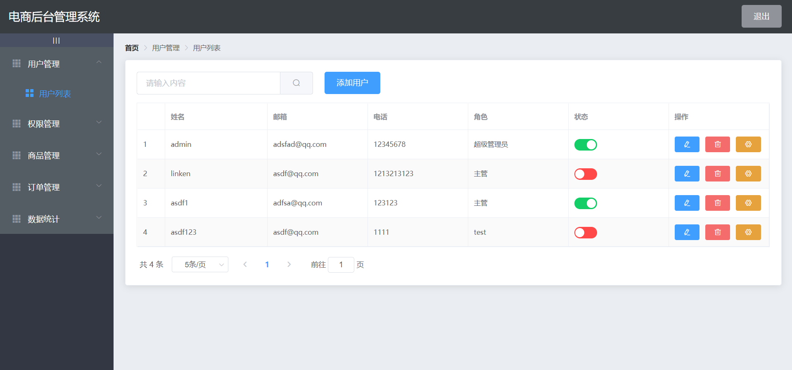

# vue_shop
### 项目技术栈:vue3.0、element-ui、axios、vue-router、less、echarts
## Project setup
```
npm install
```

### Compiles and hot-reloads for development
```
npm run serve
```

### Compiles and minifies for production
```
npm run build
```

### Lints and fixes files
```
npm run lint
```

### Customize configuration
See [Configuration Reference](https://cli.vuejs.org/config/).
### 完成的功能
使用vue与element-ui构建页面,vue-router构建路由,通过axios发起http请求获取待渲染的数据以及通过nodejs的api对后台管理系统的mysql数据库的数据进行增删改查,使用echarts进行较为简单的数据可视化。

